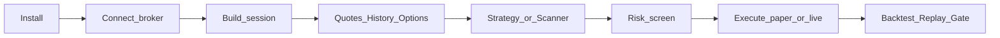

# ntrade — User Guide

ntrade lets you trade, backtest and scan Indian markets by talking to **market
objects** (`.ltp`, `.order.buy()`, `.chain.atm.greeks.delta`) instead of REST
endpoints or JSON. This guide is for traders using ntrade — not for people
extending it.

## How to read this guide

Start with install and brokers, then walk the core journey (quotes → history →
orders). Strategies, scanners and risk build on that session. Simulation shows
how to prove a strategy offline before going live. Deep dives cover Dhan-only
broker capabilities, options trading, and end-to-end flows. Every example uses
`TradingSession.paper()` unless a live Dhan credential is required.

## Sections

1. [Install & Brokers](01-install-brokers.md)
2. [Core Journey: quotes, history, orders](02-core-journey.md)
3. [Writing Strategies](03-strategies.md)
4. [Scanners](04-scanners.md)
5. [Risk & Circuit Breakers](05-risk.md)
6. [Backtest, Replay & Simulation](06-simulation.md)
7. [Broker Capabilities (Dhan extras)](07-broker-capabilities.md)
8. [Options Trading](08-options-trading.md)
9. [Trading Flows](09-trading-flows.md)

## Quick start (paper — no credentials needed)

```python
from ntrade import TradingSession

s = TradingSession.paper(initial_cash=100_000.0)
nifty = s.index("NIFTY")
nifty.market.refresh()
print(nifty.market.ltp())
```

## End-to-end journey



Work left to right. Prove everything on paper first; go live only after the
paper gate passes. For Dhan extras, options, and full flow diagrams see
sections 7–9.
